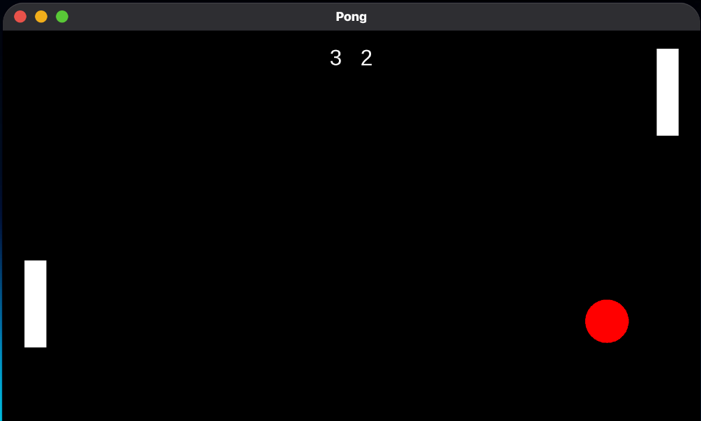
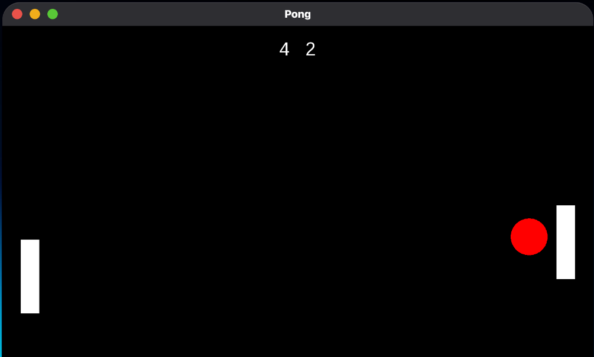
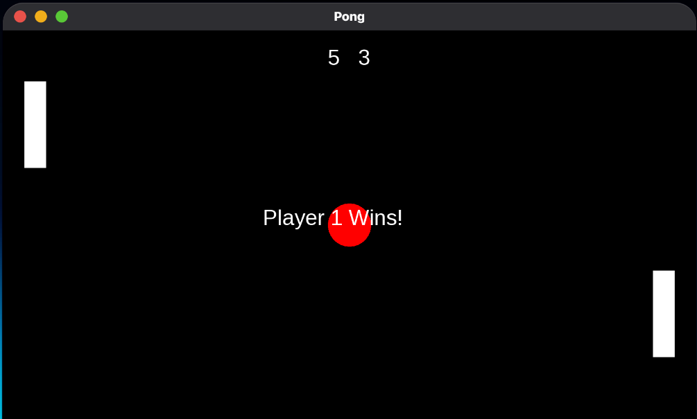

# 🏓 Pong — C++ / SFML

A classic two-player Pong game built from scratch in **C++ using SFML 3**.

This project was built to practice **Object-Oriented Programming, game loops, collision detection, physics, and basic game-state management**.

---

## 🎮 Features

- 👤 Two-player local gameplay
- ⌨️ Player 1 controls: `W / S`
- ⌨️ Player 2 controls: `↑ / ↓`
- ⚡ Delta-time based movement
- 🏓 Ball physics and bouncing
- 💥 Paddle collision detection
- 📈 Ball acceleration after paddle hits
- 🎯 Randomized ball trajectory
- 🧱 Paddle boundary collision
- 🏆 First player to reach **5 points wins**
- 🔄 Press `Enter` to start rounds
- 🔄 Press `Enter` after a win to start a new game
- 📊 Live score tracking

---

## 📸 Screenshots

### Gameplay





### Winning Screen



---

## 🧠 OOP Design

The project is split into three main classes:

### `Game`

Responsible for:

- Creating and managing the SFML window
- Running the main game loop
- Handling keyboard input
- Managing game states
- Managing scoring and winning conditions
- Coordinating the paddles and ball

### `Paddle`

Responsible for:

- Paddle creation
- Paddle movement
- Paddle rendering
- Accessing the paddle shape

### `Ball`

Responsible for:

- Ball creation
- Ball movement
- Ball velocity
- Ball bouncing
- Speed increase
- Random trajectory changes
- Ball resetting

The project uses separate `.h` and `.cpp` files to keep the code organized.

---

## 📁 Project Structure

```text
pong-game/
├── screenshots/
│   ├── gameplay1.png
│   ├── gameplay2.png
│   └── winning.png
|
├── include/
│   ├── Game.h
│   ├── Paddle.h
│   └── Ball.h
│
├── src/
│   ├── main.cpp
│   ├── Game.cpp
│   ├── Paddle.cpp
│   └── Ball.cpp
│
├── font/
│   └── DejaVuSans.ttf
│
└── README.md